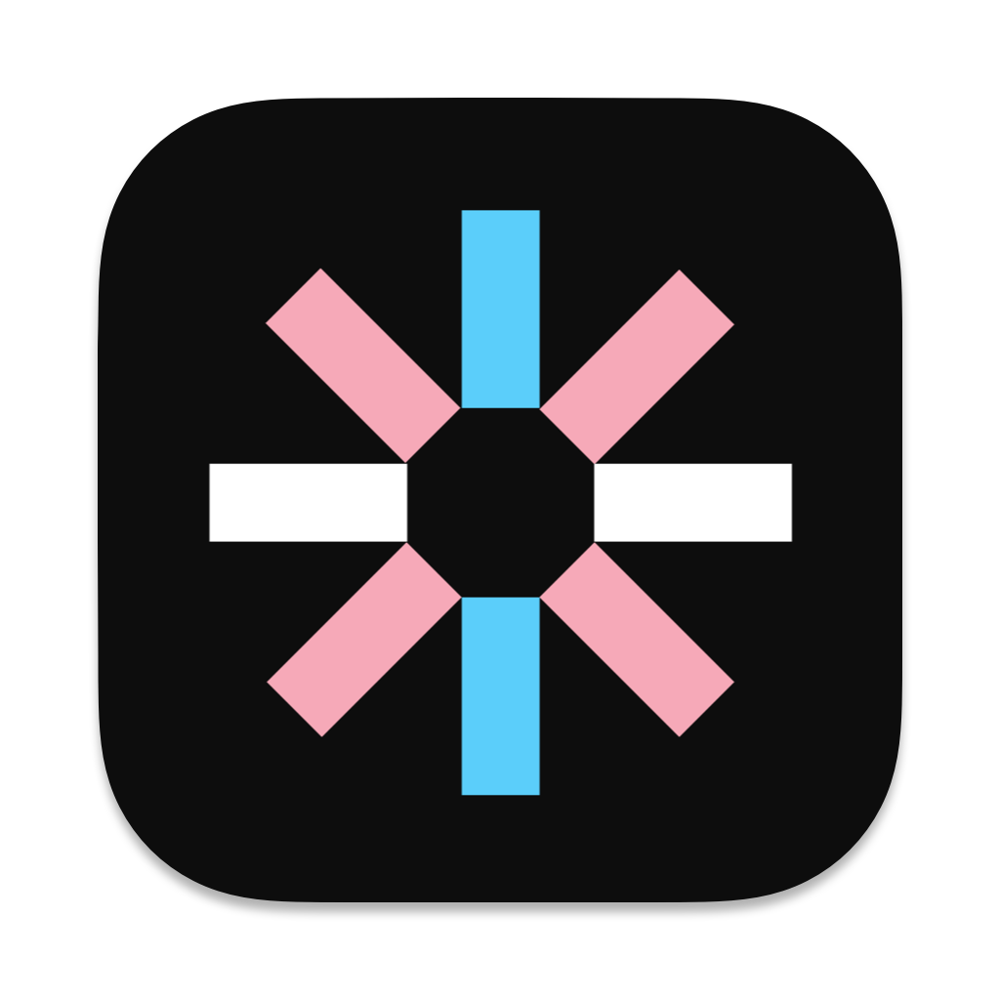

[![Contributors][contributors-shield]][contributors-url]
[![Forks][forks-shield]][forks-url]
[![Stargazers][stars-shield]][stars-url]
[![Issues][issues-shield]][issues-url]
[![MIT License][license-shield]][license-url]

<!-- TraaaaBot Logo -->

  
  

    A multi-purpose Discord bot written in discord.js that focuses on moderation, server management, and fun commmands for the public. The name originated from the idea that Traaaanns Hangout on Discord had many bots that have become unusable due their frequent outages and lack of features that are crucial for the server. This bot is a hobby project that aims to fix those problems, and has expanded to serve other communities as well. Servers who use TraaaaBot are also acknowledging that their server is a safe space for the trans community. The bot has been written independently by electrasys with JavaScript.
     
     
     
    <a href="https://github.com/electrasys/TraaaaBot"><strong>📖 View Documentation</strong></a>
     
    <a href="https://discord.gg/Xgcm52y7Yy"><strong>❗ Submit an Issue</strong></a>
  

[contributors-shield]: https://img.shields.io/github/contributors/electrasys/TraaaaBot.svg?style=for-the-badge
[contributors-url]: https://github.com/electrasys/TraaaaBot/graphs/contributors
[forks-shield]: https://img.shields.io/github/forks/electrasys/TraaaaBot.svg?style=for-the-badge
[forks-url]: https://github.com/electrasys/TraaaaBot/network/members
[stars-shield]: https://img.shields.io/github/stars/electrasys/TraaaaBot.svg?style=for-the-badge
[stars-url]: https://github.com/electrasys/TraaaaBot/stargazers
[issues-shield]: https://img.shields.io/github/issues/electrasys/TraaaaBot.svg?style=for-the-badge
[issues-url]: https://github.com/electrasys/TraaaaBot/issues
[license-shield]: https://img.shields.io/github/license/electrasys/TraaaaBot.svg?style=for-the-badge
[license-url]: https://github.com/electrasys/TraaaaBot/blob/master/LICENSE